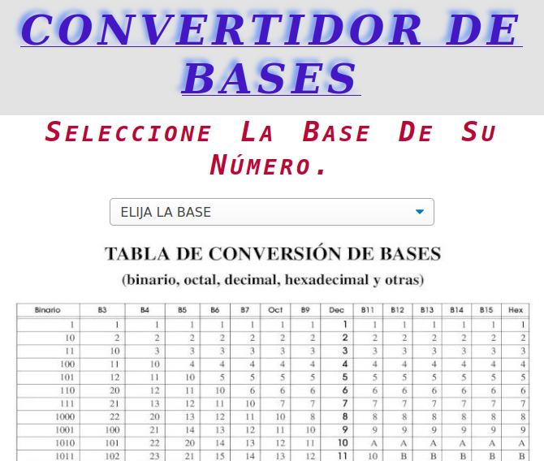

# Convertidor de Bases

## Descripción

Este proyecto es un convertidor de bases numéricas implementado con HTML, JavaScript y CSS. Permite convertir números entre los sistemas binario, octal, decimal y hexadecimal.

## Funcionalidades Clave

- Conversión entre bases: El usuario puede ingresar un número en la base seleccionada y obtener el resultado en la base deseada.
- Interfaz amigable: La interfaz es sencilla y fácil de usar, con opciones claras para elegir las bases de entrada y salida.
- Tabla de conversión: Se incluye una tabla de conversión de bases numéricas para ayudar al usuario a comprender el proceso de conversión.

## Tecnologías Utilizadas

- HTML: Para la estructura de la página.
- CSS: Para el diseño y estilo visual.
- JavaScript: Para la implementación de las operaciones de conversión.

## Cómo Utilizar

1. Accede al convertidor de bases desde el siguiente enlace:[Convertidor de Bases](https://luis-alberto-espinoza.github.io/Convertidor-de-Sistemas-/)
2. Selecciona la base de tu número en el primer menú desplegable.
3. Ingresa el número que deseas convertir en el cuadro de texto.
4. Selecciona la base a la que deseas convertir el número en el segundo menú desplegable.
5. Haz clic en el botón "Convertir" para obtener el resultado.
6. Si deseas realizar otra conversión, haz clic en el botón "Limpiar" para borrar los datos.

## Futuras Mejoras

1. Modularización
2. Abstracción
3. Comentarios y Documentación
4. Separación entre lógica y presentación 
5. Mejorar la capa de estilos en general
6. Validaciones de entrada
7. Manejo de errores 
8. Implementar el desacoplamiento entre funciones 
   

## Contribuciones

Si deseas contribuir a este proyecto, ¡eres bienvenido! Puedes hacerlo a través de pull requests en GitHub.

## Contacto

Si tienes alguna pregunta o sugerencia sobre el proyecto, no dudes en contactarme por correo electrónico o a través de GitHub.

## Autor

- Nombre: Luis Alberto Espinoza.
- Correo electrónico: espinoza.luis.alberto1981@gmail.com

¡Gracias por utilizar el Convertidor de Bases y espero que sea útil para tus necesidades de conversión numérica!
